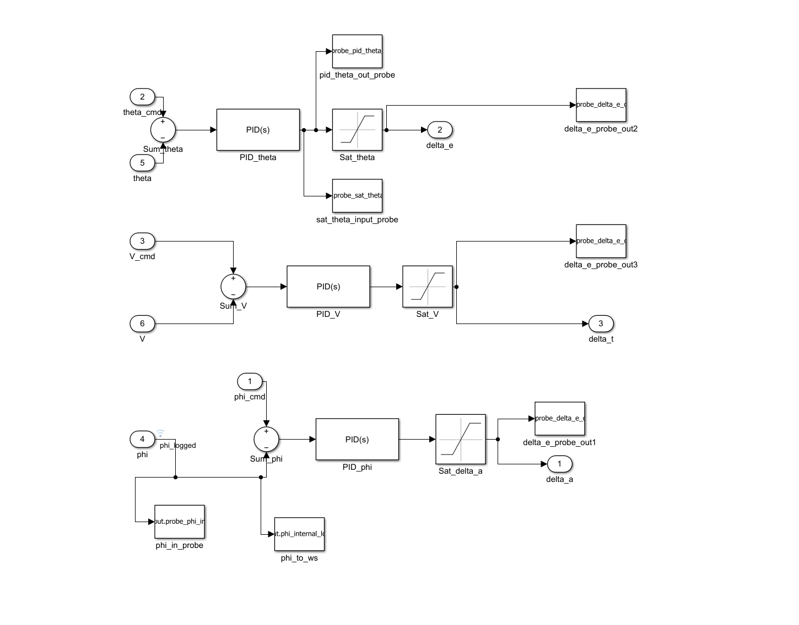
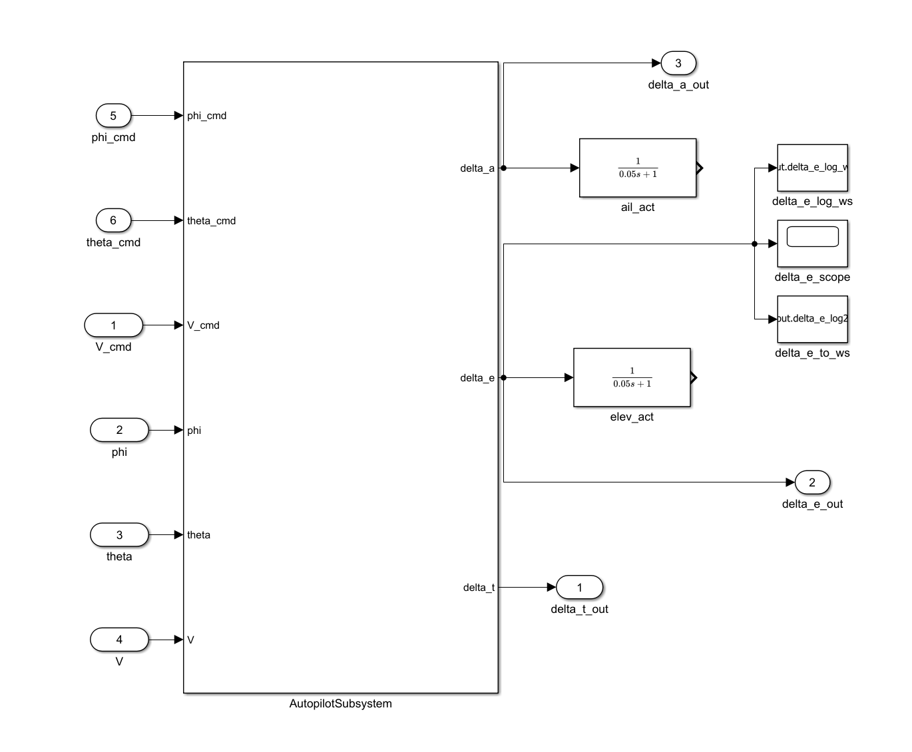
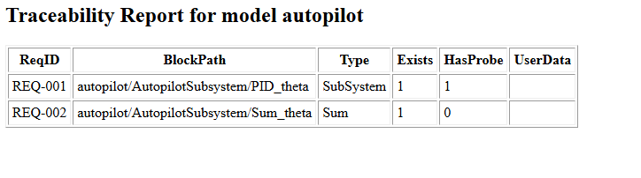
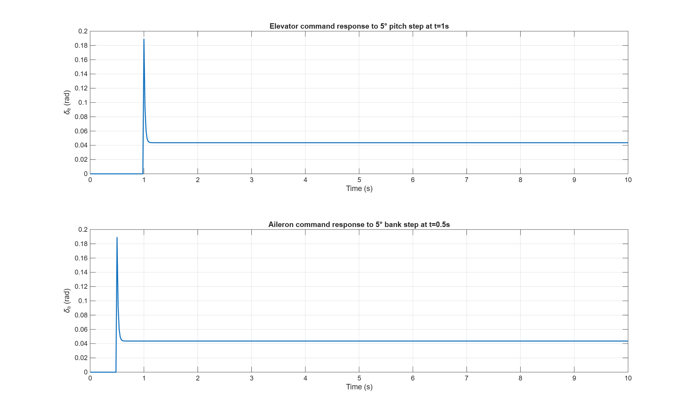

# autopilot-mbd

[](https://github.com/abdullahabduljabbarab/autopilot-mbd/actions/workflows/ci.yml)
[](LICENSE)
[](https://www.mathworks.com/products/matlab.html)

Model-Based Design of a **cascade autopilot** for aircraft attitude and
airspeed control in Simulink. Three inner-loop PID controllers (bank →
aileron, pitch → elevator, airspeed → throttle) with saturation and
probe-based verification, plus outer loops (heading → target bank,
altitude → target pitch) that turn ATC-level commands into inner-loop
setpoints. Auto-code-generated to portable C via Embedded Coder using
**reusable-function packaging**, so every consumer gets its own
per-instance state - a fleet of aircraft can run the same generated
model concurrently without shared globals.

Integrated live into the [CLEARANCE](https://github.com/abdullahabduljabbarab/CLEARANCE) ATC simulator:
every aircraft in the sim flies under the Simulink-generated
autopilot, each carrying its own PID history, filter states, and
integrator memory. See [Integration with CLEARANCE](#integration-with-clearance)
below.

Companion repos from the same simulator:

- Parent ATC simulator      https://github.com/abdullahabduljabbarab/CLEARANCE
- Simulink radar signal chain https://github.com/abdullahabduljabbarab/radar-mbd
- Federation stack showcase https://github.com/abdullahabduljabbarab/clearance-federation

<div align="center">



*Figure 1: Inside `AutopilotSubsystem`: three PID controllers with output
saturation. `phi_cmd`/`theta_cmd`/`V_cmd` inputs drive the bank, pitch,
and airspeed hold loops; outputs are `delta_a`/`delta_e`/`delta_t`
(aileron / elevator / throttle) surface commands.*

</div>

---

## Controller architecture

**Two-tier cascade.** The Simulink model runs the **inner** loops
(fast attitude and airspeed hold); the CLEARANCE-side wrapper runs
the **outer** loops (slow ATC command tracking) that generate the
`phi_cmd` / `theta_cmd` setpoints:

```
ATC command (heading / altitude / speed)
        |
        v
    +-------------------------------------------+
    | OUTER loop  (in CLEARANCE C++ wrapper)    |
    |   heading err  ->  target bank  (phi_cmd) |
    |   altitude err ->  target pitch (theta_cmd)|
    +-------------------------------------------+
        |  phi_cmd, theta_cmd, V_cmd, phi, theta, V
        v
    +-------------------------------------------+
    | INNER loop  (Simulink -> generated C)     |
    |   PID_phi   :  phi_cmd - phi     -> delta_a |
    |   PID_theta :  theta_cmd - theta -> delta_e |
    |   PID_V     :  V_cmd - V         -> delta_t |
    +-------------------------------------------+
        |  delta_a, delta_e, delta_t
        v
    Aircraft dynamics (in CLEARANCE)
```

Each PID has a saturation block modelling control-surface travel
limits (±25° aileron, ±25° elevator, 0..1 throttle). Probe outports on
pre- and post-saturation signals feed the traceability report and the
regression check.

Inner-loop gains (in `model/plant_params.m`) are tuned for a
pure-integrator plant - the CLEARANCE aircraft dynamics integrate
control-surface deflection directly, so P-only tracking is well
damped by construction. Integral action is disabled on `PID_phi`
and `PID_theta` (`Ki = 0`) because the outer loop zeroes steady-state
error at the commanded heading / altitude, and derivative action is
disabled (`Kd = 0`) after the solver-stability finding documented
below.

### Solver-stability finding: why `Kd = 0` on the attitude loops

The initial `PID_phi` / `PID_theta` gains carried a small derivative
term (`Kd = 0.05`) with the default filter coefficient `N = 100
rad/s`. Integrated into CLEARANCE, aircraft developed a
frame-rate-dependent wing rock on any vector command - visible at
60 fps in-editor, gone when the game dropped to ~2 fps.

Root cause traced back through the generated code: the model's
ODE4 solver runs at a fixed step of `h = 0.02 s`. With the
derivative filter's eigenvalue at `-N = -100 rad/s`, the product
`h · N = 2.0` sat right on the boundary of RK4's stability region
for that real-negative eigenvalue. Every per-frame `phi` micro-jitter
excited the filter into a limit cycle instead of damping out.

Two fixes were possible: shrink the solver step (heavier compute
per call), or zero the derivative gain (removes the marginal
eigenvalue entirely). Since the plant is a pure integrator,
proportional-only is provably stable and matches short-period
damping fine at ATC time scales, so `Kd = 0` is the honest choice.
Airspeed PID (`PID_V`) retains its derivative term - the speed plant
is well-damped and doesn't sit near the stability boundary.

The lesson generalises: any continuous-time PID with a filtered
derivative that codegens to a fixed-step solver needs the check
`h · N < 2.78` (RK4 stability limit for real eigenvalues) before
shipping.

<div align="center">



*Figure 2: Top-level: root inports (`phi_cmd`, `theta_cmd`, `V_cmd`, `phi`,
`theta`, `V`) feed `AutopilotSubsystem`; root outports (`delta_a_out`,
`delta_e_out`, `delta_t_out`) surface the control commands. Actuator
lag models (`1/(0.05s+1)`) live on the top level for verification;
CLEARANCE substitutes its own aircraft dynamics for integration.*

</div>

---

## Reusable-function code generation

The model is configured (`tools/configure_reusable_function.m`) with
**Code Interface Packaging = Reusable function**. Generated entry
points take a per-instance model pointer:

```c
void autopilot_initialize(RT_MODEL_autopilot_T *rtM);
void autopilot_step      (RT_MODEL_autopilot_T *rtM);
void autopilot_terminate (RT_MODEL_autopilot_T *rtM);
```

Every field of the run-time state (`blockIO`, `contStates`, `inputs`,
`outputs`) lives inside the `RT_MODEL_autopilot_T` struct pointed to
by `rtM`. Consumers allocate one per aircraft. There are **no
file-scope globals** and no shared state between instances - a fleet
of any size runs concurrently on the same generated `.c`.

---

## Repository layout

```
autopilot_repo/
|-- autopilot.slx                      <-- Simulink model (source of truth)
|-- model/
|   `-- plant_params.m                 <-- linearised trim params + PID gains
|-- tools/
|   |-- run_model_tests_and_build.m    <-- CI entry point
|   |-- compare_sim.m                  <-- tolerance-based regression
|   |-- add_control_outports.m         <-- expose delta_e / delta_a as root outports
|   |-- expose_command_inports.m       <-- promote step blocks to root inports
|   `-- configure_reusable_function.m  <-- switch code interface to reusable
|-- ci_artifacts/                      <-- smoke sim outputs (uploaded by CI)
|-- req_map.csv                        <-- requirement to block mapping
|-- traceability_report.csv            <-- Simulink Requirements Toolbox export
|-- traceability_report.html
|-- docs/
|   |-- AUTOPILOT_MBD_DESIGN.md
|   `-- img/                           <-- README figures
`-- .github/workflows/ci.yml           <-- MATLAB CI pipeline
```

## Getting started

Open `autopilot.slx` in Simulink R2023b or later with:

- Simulink
- Simulink Test
- Embedded Coder
- MATLAB Coder
- Simulink Coder

Run smoke sim + regression check locally:

```matlab
addpath(genpath(pwd))
run('model/plant_params.m')
sim('autopilot')
tools/compare_sim
```

Generate C for integration:

```matlab
run('tools/configure_reusable_function.m') % once, sets the code interface
rtwbuild('autopilot')            % produces autopilot.c + autopilot.h
```

Output lands in `autopilot_ert_rtw/`. The CI job also copies `.c` /
`.h` to `codegen_out/` and uploads as a workflow artefact.

## Verification

Every requirement in [`req_map.csv`](req_map.csv) traces to a specific
block. [`traceability_report.html`](traceability_report.html) renders
the coverage matrix. [`Requirements.md`](Requirements.md) tabulates
all 17 REQ-AP-* entries with a Source column citing the textbook or
standard each derives from (Åström & Murray, Franklin/Powell,
EASA CS-25). [`docs/V_AND_V_PLAN.md`](docs/V_AND_V_PLAN.md) is the
strategy document: three test tiers (Simulink Test probes, baseline
regression, code-generation + CLEARANCE integration), coverage targets,
and what the plan deliberately doesn't cover.

<div align="center">



*Figure 3: Traceability report generated by the Simulink Requirements
Toolbox. 17 REQ-AP-* entries traced to specific blocks and root ports;
100% coverage. `Exists = 1` confirms the block still exists in the
current model, `HasProbe = 1` confirms a verification probe is
attached to that block for the regression signal capture in
`ci_artifacts/simOut_with_pid_defaults.mat`.*

</div>

`tools/compare_sim.m` loads `ci_artifacts/simOut_with_pid_defaults.mat`
and fails CI on any drift outside tolerance.

<div align="center">



*Figure 4: Smoke-sim response after the `Kd = 0` design change on the
attitude PIDs. Top: elevator command to a 5° pitch step at t = 1 s.
Bottom: aileron command to a 5° bank step at t = 0.5 s. Both signals
show a clean proportional-only response — a fast initial rise to
~0.19 rad (~10.9°) followed by an immediate settle to the ~0.043 rad
(~2.5°) steady-state trim required to hold the commanded attitude,
with no derivative kick and no integrator wind-up. Both peaks sit
well inside the ±25° (±0.44 rad) saturation limit, so `Sat_delta_a`
and `Sat_theta` remain inactive over this envelope. This is the
frame-rate-independent behaviour that replaced the pre-fix wing rock
described in the solver-stability finding above.*

</div>

## Integration with CLEARANCE

The CLEARANCE ATC simulator carries a `ClearanceAutopilotMBD` UE
plugin module. Its architecture:

- **Per-aircraft `FAutopilotWrapper`** - each aircraft's
 `UClearanceAircraftBehaviour` owns one. The wrapper allocates its
 own `RT_MODEL_autopilot_T` on first use.
- **`AutopilotGeneratedUnit.cpp` shim** - a single translation unit
 includes `autopilot.c` from `ThirdParty/AutopilotGenerated/src/` so
 Unreal Build Tool compiles it into the module without needing a
 per-file compilation rule.
- **`Build.cs` auto-detection** - presence of the generated `include/`
 and `src/` directories flips `CLEARANCE_AUTOPILOT_MBD_HAVE_CODEGEN=1`
 and the wrapper switches from a P-only stub to the real generated
 model transparently.
- **Cascade wiring** - the wrapper computes `phi_cmd` (heading → bank)
 and `theta_cmd` (altitude → pitch) outer loops in C++, pushes them
 plus the aircraft's live state into the model's `ExtU` struct,
 steps once, reads back `delta_a` / `delta_e` / `delta_t` from
 `ExtY`, and translates them into aircraft rate changes.

Console commands in-sim:

```
clearance.autopilot.engage <callsign>
clearance.autopilot.disengage <callsign>
```

Every aircraft is autopilot-engaged by default. Disengage puts a
specific aircraft back on CLEARANCE's built-in rate-limited slew for
A/B comparison.

## Continuous integration

`.github/workflows/ci.yml` runs on manual dispatch (MATLAB licensing
on GitHub-hosted runners is a separate concern - see the CI notes in
CLEARANCE). Steps:

1. Set up MATLAB (`matlab-actions/setup-matlab@v2`).
2. Run `tools/run_model_tests_and_build.m` - smoke sim + Test Manager.
3. `rtwbuild('autopilot')` - Embedded Coder generates C.
4. Upload `codegen_out/`, `ci_artifacts/`, and traceability reports as
  workflow artefacts.

## Video walkthrough

Full technical walkthrough covering this autopilot alongside its
sister [radar-mbd](https://github.com/abdullahabduljabbarab/radar-mbd)
Simulink model: model authoring, Embedded Coder code generation,
reusable-function packaging, and live integration into the CLEARANCE
UE5 simulator with every aircraft flying under the generated code.

https://youtu.be/nqjFOimsYHw

| Timestamp | Section |
|---|---|
| 00:00 | Intro |
| 00:21 | Simulink autopilot model |
| 01:20 | Simulink radar model *(companion `radar-mbd` repo)* |
| 02:33 | MVDR beam patterns *(radar)* |
| 03:23 | Range-Doppler + CFAR *(radar)* |
| 03:41 | Autopilot code generation |
| 04:07 | Radar code generation *(radar)* |
| 04:20 | Generated ANSI C, side by side |
| 04:28 | Third-party integration |
| 04:46 | Autopilot wrapper |
| 05:30 | Radar wrapper *(radar)* |
| 05:46 | Live autopilot flying every aircraft |
| 07:30 | Live radar scope + EW demo *(radar)* |

## References and further reading

Textbooks and standards the design leans on:

- **Åström & Murray**, *Feedback Systems: An Introduction for Scientists and Engineers* (Princeton, 2nd ed. 2020). Cascade PID theory, derivative-filter cut-off intuition, saturation-with-anti-windup patterns. Freely available at https://fbswiki.org.
- **Franklin, Powell & Emami-Naeini**, *Feedback Control of Dynamic Systems* (Pearson, 8th ed.). Reference for the fixed-step-solver stability check `h · N < 2.78` that drove the `Kd = 0` finding on the attitude PIDs.
- **MathWorks Embedded Coder documentation** on Code Interface Packaging = **Reusable function**, which is what makes the generated `autopilot_step(RT_MODEL_autopilot_T *rtM)` re-entrant across multiple aircraft instances. https://www.mathworks.com/help/ecoder/ug/generate-reusable-code-from-subsystems-shared-across-models.html
- **EASA CS-25** control-surface deflection envelopes as the source of the ±25° aileron and ±25° elevator saturation limits.

## License

MIT - see [`LICENSE`](LICENSE).
